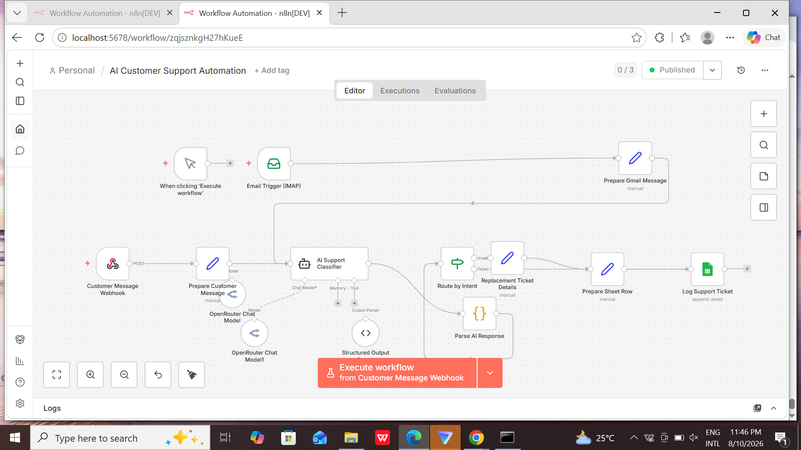
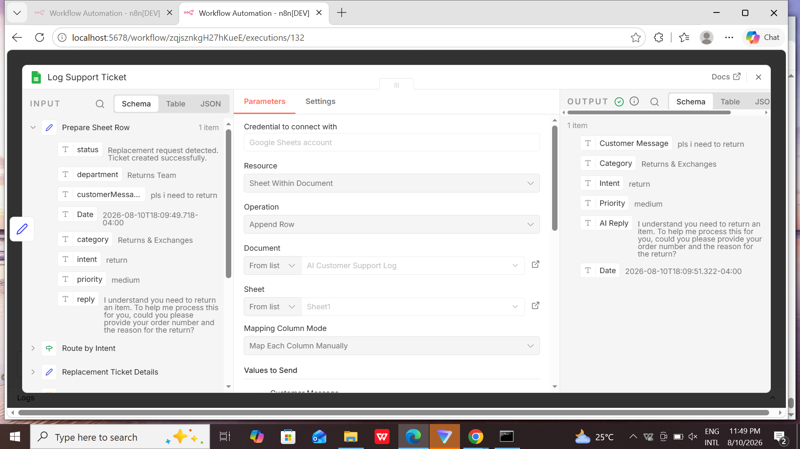

# AI Customer Support Automation

## Project Overview

AI Customer Support Automation is an AI-powered customer support workflow built with n8n.

The automation receives customer support emails, analyzes the customer's request using an AI model, classifies the request by intent and priority, routes the request to the appropriate support path, generates an AI-assisted response, and logs the support ticket in Google Sheets.

The goal of this project is to reduce repetitive customer-support processing and demonstrate how AI can be integrated into an automated business workflow.

## Problem Statement

Customer support teams often spend significant time reading incoming emails, identifying the customer's request, determining its priority, deciding which department should handle it, and recording the request manually.

This process can be repetitive, time-consuming, and prone to inconsistent categorization.

This project addresses the problem by automatically analyzing incoming customer emails and converting them into structured support tickets.

## Project Goal

The goal of this project was to build an automated customer-support system that can:

- Receive customer emails automatically
- Extract the customer's message
- Use AI to understand the customer's request
- Classify the request into a predefined intent
- Determine the appropriate priority
- Generate an AI-assisted customer response
- Route the request based on its intent
- Store the resulting support ticket in Google Sheets

## Technologies Used

| Technology | Purpose |
|---|---|
| **n8n** | Workflow automation and orchestration |
| **AI Agent / AI Model** | Customer-message analysis and classification |
| **Email (IMAP)** | Receiving customer support emails |
| **Google Sheets** | Storing and managing support tickets |
| **JSON** | Structured data exchange between workflow nodes |

## Supported Customer Intents

The AI classifier currently supports six customer-support intents:

1. **Replacement** — The customer wants a replacement for a damaged, defective, wrong, or faulty item.
2. **Refund** — The customer wants their money back.
3. **Return** — The customer wants to return an item.
4. **Track Order** — The customer wants to know where their order is.
5. **Incorrect Charge** — The customer reports that they were charged incorrectly.
6. **Other** — The request does not fit any of the categories above.

## Workflow Architecture

The automation follows this general process:

```text
Customer Email
↓
Email Trigger (IMAP)
↓
Prepare Customer Message
↓
AI Support Classifier
↓
Parse AI Response
↓
Route by Intent
↓
Intent-Specific Processing
↓
Prepare Sheet Row
↓
Log Support Ticket
↓
Google Sheets
```

### Workflow Overview

1. **Email Trigger (IMAP)** receives an incoming customer-support email.
2. **Prepare Customer Message** extracts and standardizes the customer's message.
3. **AI Support Classifier** analyzes the message and determines the category, intent, priority, and appropriate response.
4. **Parse AI Response** converts the AI result into structured data that can be used by the workflow.
5. **Route by Intent** determines which support path should handle the request.
6. **Intent-Specific Processing** prepares the appropriate information for the selected support path.
7. **Prepare Sheet Row** organizes the information into a consistent support-ticket format.
8. **Log Support Ticket** sends the structured ticket to Google Sheets.

## AI Classification Process

The AI analyzes each incoming customer message and converts the unstructured email into structured support information.

For every message, the AI determines:

- **Category** — The general type of support request
- **Intent** — The specific action requested by the customer
- **Priority** — The urgency of the request
- **Reply** — An AI-generated customer-support response

The AI is instructed to classify the customer's request based only on the actual message received.

### Structured AI Output

The AI response is converted into structured data so that other workflow nodes can process it automatically.

Example:

```json
{
  "category": "Returns & Exchanges",
  "intent": "replacement",
  "priority": "medium",
  "reply": "I can help you with that. Could you please provide more details about the item you need to replace and the reason for the replacement request?"
}
```

### Intent Routing

After the AI classifies the customer message, the workflow uses the detected intent to determine the appropriate support path.

The workflow currently supports the following routes:

- `replacement` → Replacement support
- `refund` → Refund support
- `return` → Return support
- `track_order` → Order tracking support
- `incorrect_charge` → Billing support
- `other` → General support

This allows different types of customer requests to be processed automatically without requiring a support agent to manually categorize every incoming email.

## Support Ticket Logging

After the customer request has been classified and processed, the workflow prepares the information for storage in Google Sheets.

Each support ticket contains:

- **Customer Message**
- **Category**
- **Intent**
- **Priority**
- **AI Reply**
- **Date**

This creates a structured record of each customer-support request and provides a simple way for support teams to review incoming tickets.

### Example Ticket

| Field | Example |
|---|---|
| Customer Message | I need a replacement |
| Category | Returns & Exchanges |
| Intent | replacement |
| Priority | medium |
| AI Reply | I can help you with that. Could you please provide more details about the item you need to replace? |
| Date | 2026-08-10 |

## Testing

The workflow was tested using different customer-support scenarios to verify that the AI correctly identified customer intent and that the resulting information was successfully logged in Google Sheets.

### Replacement Test

**Customer message:**

> My shoes arrived damaged and I would like a replacement.

**Result:**

- Intent: `replacement`
- Category: `Returns & Exchanges`
- Priority: `high`
- Support ticket successfully logged in Google Sheets.

### Refund Test

**Customer message:**

> I am not satisfied with my order and I would like a refund.

**Result:**

- Intent: `refund`
- Support ticket successfully logged in Google Sheets.

## 📊 Results

The completed workflow successfully automates the initial customer-support process from receiving an email to creating a structured support ticket.

The automation successfully:

- Receives incoming customer emails
- Extracts customer messages
- Classifies requests using AI
- Identifies customer intent
- Assigns a priority
- Generates an AI-assisted response
- Routes requests based on intent
- Logs structured support tickets in Google Sheets

## 🧠 What I Learned

Through this project, I learned how to:

- Build automated workflows using n8n
- Connect email and Google Sheets to an automation
- Use AI to classify unstructured customer messages
- Work with structured JSON data
- Route workflow data based on AI-generated intent
- Map data between different workflow nodes
- Debug workflow execution errors
- Test and validate an end-to-end automation

## 🚀 Future Improvements

Possible improvements include:

- Automatically sending the AI-generated reply to the customer
- Adding Slack or Microsoft Teams notifications
- Creating a customer-support dashboard
- Sending high-priority tickets to a human support agent
- Connecting the workflow to a CRM
- Adding more customer-support intents
- Adding automated customer follow-ups

## 🖼️ Workflow Screenshots

### n8n Workflow

The complete customer-support automation workflow in n8n.



### Google Sheets Support Ticket

Example of a support ticket generated and logged automatically.



## 📁 Project Files

- [`README.md`](README.md) — Project documentation
- [`customer-support-automation.json`](workflow/customer-support-automation.json) — Exported n8n workflow
- [`workflow.png`](screenshots/workflow.png) — Complete n8n workflow screenshot
- [`google-sheets-ticket.png`](screenshots/google-sheets-ticket.png) — Example of a generated support ticket
